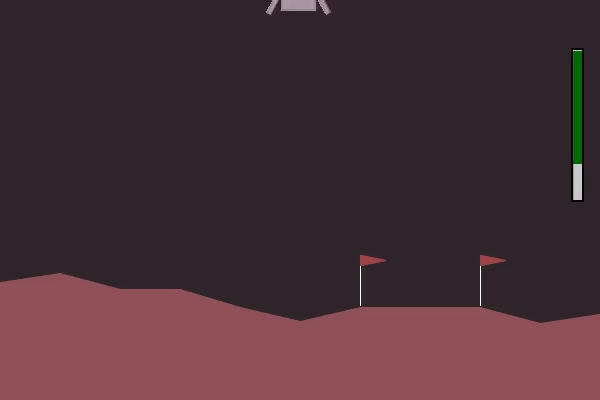
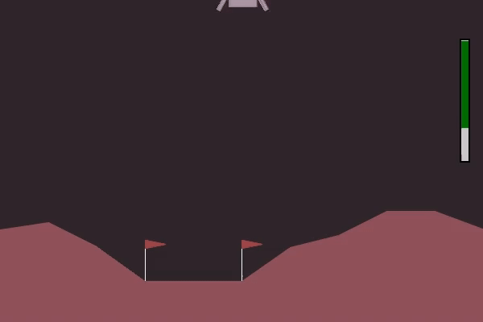

    <h1></h1>

# OpenAI Gym | Lunar Lander

    

    
    

 

    
    
    
    

## Project Overview

This project explores the impact of customizing an `OpenAI Gym Environment` on **reinforcement learning (RL) performance**. We modified an existing Gym environment - Lunar Lander - in order to train an RL agent using the Stable Baselines library, and later compare results between the **customized and original environments**.

The process involves:

- **Environment Customization**: **Implement changes** such as altered rewards or added challenges to the Environment.
- **Agent Training**: Train an RL agent with **algorithms like PPO** and further **tune their hyperparameters** to ensure optimal performance.
- **Evaluation**: **Compare agent performance** in both environments to analyze the effect of the customizations.

This project aims to analyse **how does the environment design influence the outcomes of a Reinforcement Learning Algorithm**.

## Project Results

> ADD PROJECT RESULTS

<table width="100%">
    <thead>
        <th></th>
        <th>
            

                Original Environment
            

        </th>
        <th>
            

                Custom Environment
            

        </th>
    </thead>
    <tbody>
        <tr>
            <td width="10%">
                

                    [PPO] Settings1
                

            </td>
            <td width="45%">
                

                    
                

            </td>
            <td width="45%">
                

                    
                

            </td>
        </tr>
        <tr>
            <td width="10%">
                

                    [PPO] Settings2
                

            </td>
            <td width="45%">
                

                    [NOT DONE]
                    <!--  -->
                

            </td>
            <td width="45%">
                

                    
                

            </td>
        </tr>
        <tr>
            <td width="10%">
                

                    [DQN] Settings1
                

            </td>
            <td width="45%">
                

                    
                

            </td>
            <td width="45%">
                

                    
                

            </td>
        </tr>
        <tr>
            <td width="10%">
                

                    [DQN] Settings2
                

            </td>
            <td width="45%">
                

                    [NOT DONE]
                    <!--  -->
                

            </td>
            <td width="45%">
                

                    
                

            </td>
        </tr>
    </tbody>
</table>

## Authorship

- **Authors** &#8594; [Gonçalo Esteves](https://github.com/EstevesX10), [Nuno Gomes](https://github.com/NightF0x26) and [Pedro Afonseca](https://github.com/PsuperX)
- **Course** &#8594; Introduction to Intelligent Autonomous Systems [[CC3042](https://sigarra.up.pt/fcup/en/ucurr_geral.ficha_uc_view?pv_ocorrencia_id=546531)]
- **University** &#8594; Faculty of Sciences, University of Porto

<!--  -->

`README.md by Gonçalo Esteves`

